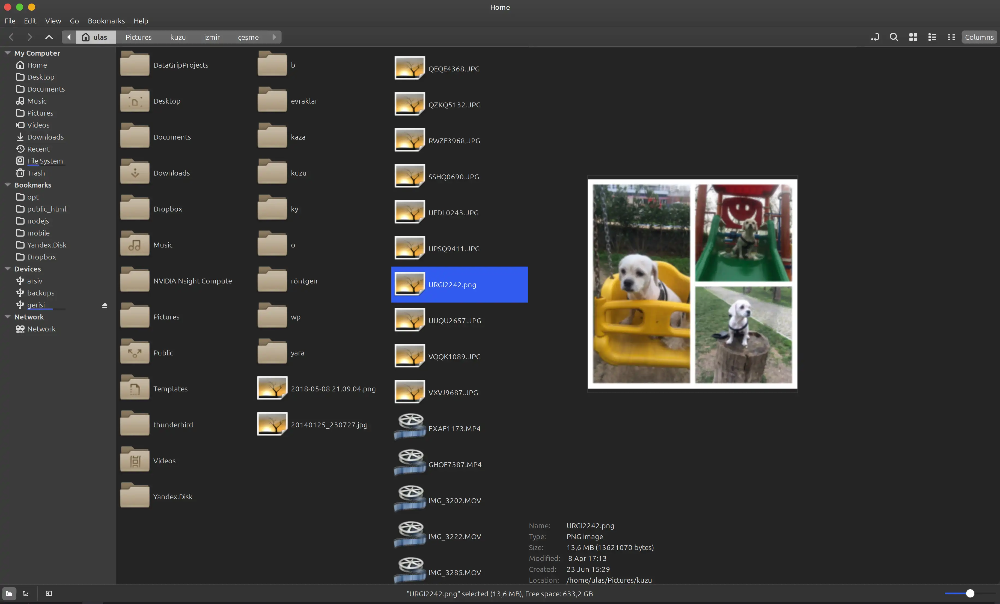
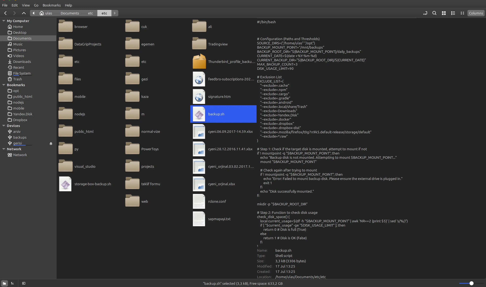
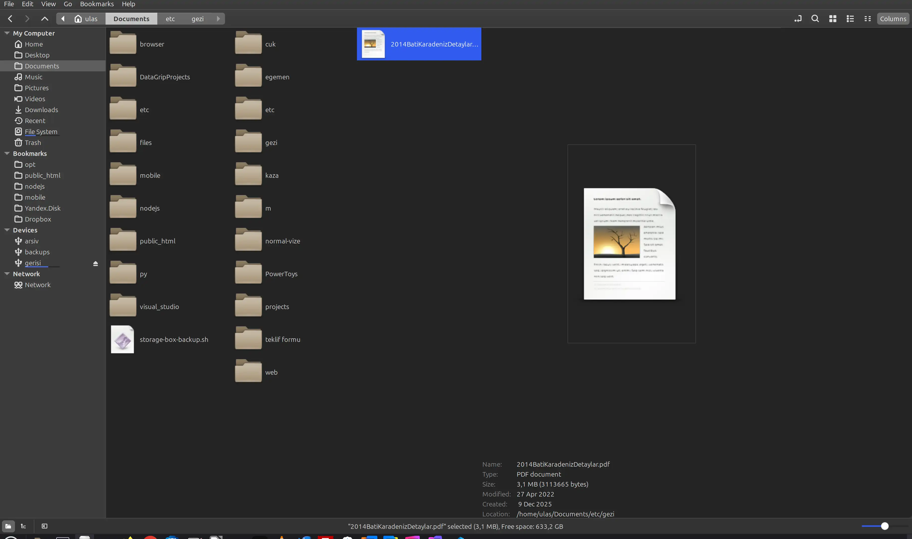

Note
----
We use Linux Mint for everything and found Nemo lacking a column view. We added a simple macOS Finder-style Column View to Nemo. Nemo's upstream is at https://github.com/linuxmint/nemo. You can use https://www.simpletools.nl/ to contact us

This app is based on nemo 6.6.3 (You can view it on master branch)

Packaging / installation
------------------------
This build ships as the Debian package **`nemo-with-column-view`** (version line **7.x**), not as
`nemo`. It *takes over* the distribution's `nemo` package: it declares versioned
`Provides: nemo (= 7.0.0), nemo-data (= 7.0.0), libnemo-extension1 (= 7.0.0), gir1.2-nemo-3.0 (= 7.0.0)`
plus `Replaces`/`Breaks` for their older versions, and `Conflicts` with `nemo-dbg`/`cinnamon-dbg`.
That is required because both packages install the same files
(`/usr/share/nemo`, `org.nemo.gschema.xml`, `libnemo-extension.so.1`, …); as a side effect
`apt upgrade` no longer tries to "upgrade" this build back to the stock nemo.

```bash
sudo apt install ./nemo-with-column-view_7.0.0_amd64.deb
```
(`apt` resolves the conflict in one transaction: it removes the stock `nemo`,
`nemo-data`, `libnemo-extension1`, `gir1.2-nemo-3.0` and the `*-dbg` packages and installs this
one. If you use plain `sudo dpkg -i …` instead, follow it with `sudo apt-get install -f` — the
transition state keeps the distro packages around until then.)

**Do not install the .deb from the Software Center / mintinstall.** The graphical installer
cannot resolve conflicts, so it stops with
`Error: Conflicts with the installed package 'nemo-dbg' / 'cinnamon-dbg'`. That conflict is
intentional: the debug packages pin `nemo` to an exact distribution version, which a package
that *provides* `nemo` can never satisfy, so they must be removed — which the terminal command
above does in the same transaction.

`nemo-fileroller` (Compress… / Extract Here) is installed as a dependency, not bundled.

The launcher is shown as **Nemo with Column View**. The on-disk identity is deliberately
unchanged so the rest of the desktop keeps working: `/usr/share/nemo`, the `org.nemo.*` GSettings
schemas, `libnemo-extension.so.1`, the `nemo.desktop` launcher id, the `org.Nemo` D-Bus name and
the `.nemo_action` extension. The executable is `/usr/bin/nemo-with-column-view`, with a
compatibility `/usr/bin/nemo` symlink.

Nemo
====
Nemo is a free and open-source software and official file manager of the Cinnamon desktop environment. 
It is a fork of GNOME Files (formerly named Nautilus).

Nemo also manages the Cinnamon desktop.
Since Cinnamon 6.0 (Mint 21.3), users can enhance their own Nemo with Spices named Actions.

Screenshots
===========
     


History
====
Nemo started as a fork of the GNOME file manager Nautilus v3.4. Version 1.0.0 was released in July 2012 along with version 1.6 of Cinnamon,
reaching version 1.1.2 in November 2012.

Developer Gwendal Le Bihan named the project "nemo" after Jules Verne's famous character Captain Nemo, who is the captain of the Nautilus.

Features
====
Nemo v1.0.0 had the following features as described by the developers:
1. Ability to SSH into remote servers
2. Native support for FTP (File Transfer Protocol) and MTP (Media Transfer Protocol)
3. All the features Nautilus 3.4 had and which are missing in Nautilus 3.6 (all desktop icons, compact view, etc.)
4. Open in terminal (integral part of Nemo)
5. Open as root (integral part of Nemo)
6. Uses GVfs and GIO
7. File operations progress information (when copying or moving files, one can see the percentage and information about the operation on the window title and so also in the window list)
8. Proper GTK bookmarks management
9. Full navigation options (back, forward, up, refresh)
10. Ability to toggle between the path entry and the path breadcrumb widgets
11. Many more configuration options
